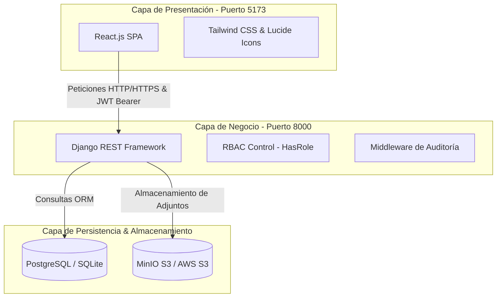

# 🛡️ SIGCGOE: Sistema Integral para la Gestión y Control de la Guardia Obrera y Estudiantil
## 🎓 Universidad de Holguín (UHO) - Tesis de Ingeniería Informática 2027

Este repositorio constituye el núcleo oficial del **SIGCGOE**, un sistema web corporativo diseñado para automatizar y optimizar la planificación, el control y la evaluación de la guardia obrera y estudiantil en la Universidad de Holguín.

---

## 🏛️ Arquitectura del Sistema

El sistema implementa un enfoque de **arquitectura de tres capas deslocalizada**, separando estrictamente la interfaz de usuario (Frontend SPA) de la lógica de negocio (Backend REST API), lo cual garantiza escalabilidad, seguridad e interoperabilidad con el ecosistema de la UHO.

### 📊 Diagrama de Arquitectura


### 🛠️ Stack Tecnológico
*   **Frontend:** React.js (Vite) + Tailwind CSS + Axios.
*   **Backend:** Django REST Framework (Python 3.10+).
*   **Base de Datos:** PostgreSQL (Producción) / SQLite (Desarrollo).
*   **Almacenamiento:** MinIO (Local) / AWS S3 (Producción) para actas y fotos de perfiles.
*   **Auditoría & Trazabilidad:** Middleware de Auditoría inmutable que registra automáticamente acciones CRUD.
*   **Documentación de API:** Swagger UI & OpenAPI 3.0 via `drf-spectacular`.
*   **Despliegue & DevOps:** Docker, Docker Compose, Gunicorn, Nginx y GitLab CI/CD.

---

## 📂 Estructura General del Proyecto

```text
Entorno de Trabajo UHO/
├── docker-compose.yml       # Orquestador maestro de contenedores Docker
├── README.md                # Guía maestra y documento de arquitectura
│
├── backend/                 # API Django REST Framework
│   ├── Dockerfile           # Imagen Docker para el backend
│   ├── requirements.txt     # Dependencias de Python (Django, JWT, simplejwt, etc.)
│   ├── .env.example         # Ejemplo de variables de entorno del backend
│   ├── config/              # Ajustes de configuración del proyecto Django
│   ├── core/                # Modelos y lógica transversal (RBAC, Auditoría)
│   ├── authentication/      # Modelo CustomUser, Autenticación y JWT
│   └── modules/             # Submódulos específicos de negocio
│       ├── guardia_admin/   # MOD-01: CRUD Nomencladores y Sincronización
│       ├── compromiso/      # MOD-03 y MOD-04: Compromiso Obrero y Estudiantil
│       ├── potencial/       # MOD-05: Aprobación y gestión de potencial
│       ├── distribucion/    # MOD-06: Distribución de turnos y guardias
│       ├── control/         # MOD-07: Control de asistencia y evaluación
│       └── reportes/        # MOD-08: Dashboard e informes (PDF/Excel)
│
├── frontend/                # React.js Single Page Application
│   ├── Dockerfile           # Imagen Docker para el frontend
│   ├── package.json         # Control de dependencias de Node.js
│   ├── index.html           # HTML principal del cliente
│   └── src/
│       ├── index.css        # Estilos globales y Glassmorphism
│       ├── services/api.js  # Cliente HTTP Axios configurado con interceptores de JWT
│       ├── context/         # AuthContext con simulador de roles local
│       ├── pages/           # Vistas (Login y Dashboard interactivo con RBAC)
│       └── App.jsx          # Enrutador principal de la aplicación
│
└── docs/                    # Documentación técnica detallada
    ├── architecture.md      # Detalles de seguridad y middleware de auditoría
    └── deployment_ubuntu.md # Guía paso a paso para servidores de producción
```

---

## 🔐 Control de Acceso Basado en Roles (RBAC)

La seguridad del sistema está regida por roles institucionales. Cada rol tiene definidos límites lógicos estrictos tanto en la interfaz de usuario como en los endpoints del servidor:

| Rol de Guardia | Descripción | Permisos Principales |
| :--- | :--- | :--- |
| **SUPERADMIN** | Administrador de sistemas de la UHO | Acceso total, CRUD de nomencladores globales, logs de auditoría e importación de registros. |
| **JEFE_SEGURIDAD** | Jefe del Dpto. de Seguridad y Protección | Distribución global de guardias por sedes/áreas, reportes y métricas globales. |
| **RESPONSABLE_AREA** | Decano o Jefe de Dirección Universitaria | Aprobación del potencial del área/facultad, asignación de días de guardia. |
| **RESPONSABLE_DEPTO** | Jefe de Departamento Docente/Servicios | Distribución y asignación directa de personas a los días de guardia correspondientes. |
| **TRABAJADOR** | Guardia Obrero (Docente o No Docente) | Firma de su compromiso de guardia obrera, consulta de su cronograma anual personal. |
| **ESTUDIANTE** | Guardia Estudiantil (Estudiante Activo) | Firma de su compromiso estudiantil, consulta de su cronograma anual personal. |

---

## 💻 Guía de Despliegue Estricta

### Opción A: Despliegue Local Rápido con Docker (Recomendado)
Levanta todos los servicios aislados en contenedores con un único comando:

1. **Requisitos:** Asegurarse de tener Docker y Docker Compose instalados.
2. **Ejecutar:**
   ```bash
   docker-compose up --build
   ```
3. **Servicios Disponibles:**
   * Frontend: `http://localhost:5173`
   * Backend API: `http://localhost:8000/api/`
   * Documentación Swagger: `http://localhost:8000/api/docs/`
   * Consola MinIO S3: `http://localhost:9001` (Credenciales por defecto en `.env`)

---

### Opción B: Despliegue Nativo para Desarrollo en Windows

#### 1. Configuración del Backend (Django)
1. Abre una terminal en la carpeta `/backend`:
   ```powershell
   cd backend
   ```
2. Crea el entorno virtual e instala los paquetes:
   ```powershell
   python -m venv .venv
   .venv\Scripts\Activate.ps1
   pip install -r requirements.txt
   ```
3. Ejecuta las migraciones y arranca el servidor local:
   ```powershell
   python manage.py makemigrations
   python manage.py migrate
   python manage.py runserver
   ```
   *API disponible en: `http://localhost:8000/api/`*

#### 2. Configuración del Frontend (React)
1. Abre una terminal en la carpeta `/frontend`:
   ```powershell
   cd frontend
   ```
2. Instala los módulos e inicia el servidor de desarrollo Vite:
   ```powershell
   npm install
   npm run dev
   ```
   *Frontend disponible en: `http://localhost:5173`*

---

### Opción C: Despliegue en Producción (Ubuntu Server 22.04 LTS)
Consulte el archivo detallado [deployment_ubuntu.md](file:///c:/Users/hchee/OneDrive/Documentos/Sistema%20para%20la%20Gestion%20de%20la%20Guardia%20UHO/Entorno%20de%20Trabajo%20UHO/docs/deployment_ubuntu.md) para configurar:
* Base de datos PostgreSQL institucional.
* Servicio Systemd con Gunicorn para servir el backend Django.
* Proxy inverso Nginx para enrutar la API y servir la compilación de React (`npm run build`).
* Pipeline de integración y despliegue continuo (CI/CD) con GitLab.

---

## 🗺️ Mapa de Ruta del Proyecto (Roadmap de la Tesis)

A continuación se detalla la lista de verificación (checklist) oficial de los módulos lógicos pendientes y el avance estructurado del trabajo:

- [x] **Hito 1: Definición de Arquitectura y Boilerplate (2026)**
  - [x] Unificación de repositorios Git en una estructura modular y organizada.
  - [x] Modelado inicial del usuario personalizado y control de acceso (RBAC).
  - [x] Creación de base de datos de desarrollo local y migraciones iniciales (`v1.0`).
- [ ] **Hito 2: Módulo de Administración y Perfiles (Fase Inicial)**
  - [ ] **[MOD-01]** CRUD de Nomencladores (Áreas, Departamentos, Sedes, Cargos, Contratos).
  - [ ] **[MOD-01]** Sincronización simulada de datos primarios desde ASSET y SIGENU.
  - [ ] **[MOD-02]** Vista de Perfil y edición de datos de contacto de trabajadores/estudiantes.
- [ ] **Hito 3: Módulos de Compromiso de Guardia (Fase Intermedia)**
  - [ ] **[MOD-03]** Formulario y persistencia de Compromiso de Guardia para Trabajadores.
  - [ ] **[MOD-04]** Flujo de Compromiso y parámetros por defecto para Estudiantes.
  - [ ] **[MOD-05]** Listado de Potencial y flujo de aprobación por lotes para jefes de área.
- [ ] **Hito 4: Módulos de Distribución y Operación Diaria (Fase Avanzada)**
  - [ ] **[MOD-06]** Distribución mensual de turnos y asignación de personas a días específicos.
  - [ ] **[MOD-07]** Registro del Control de Guardia diario y evaluaciones (Bien, Regular, Mal).
  - [ ] **[MOD-09]** Sistema de notificaciones en tiempo real por correo y campana.
- [ ] **Hito 5: Reportes y Cierre de Tesis (2027)**
  - [ ] **[MOD-08]** Dashboard de cumplimiento interactivo y estadísticas gráficas.
  - [ ] **[MOD-08]** Generación y exportación de reportes a PDF (WeasyPrint) y Excel.
  - [ ] **[MOD-10]** Documentación Swagger final e integración con el ecosistema de la UHO.
  - [ ] Pruebas unitarias de cobertura (Mínimo 60%).
  - [ ] Redacción final del informe técnico de tesis.
